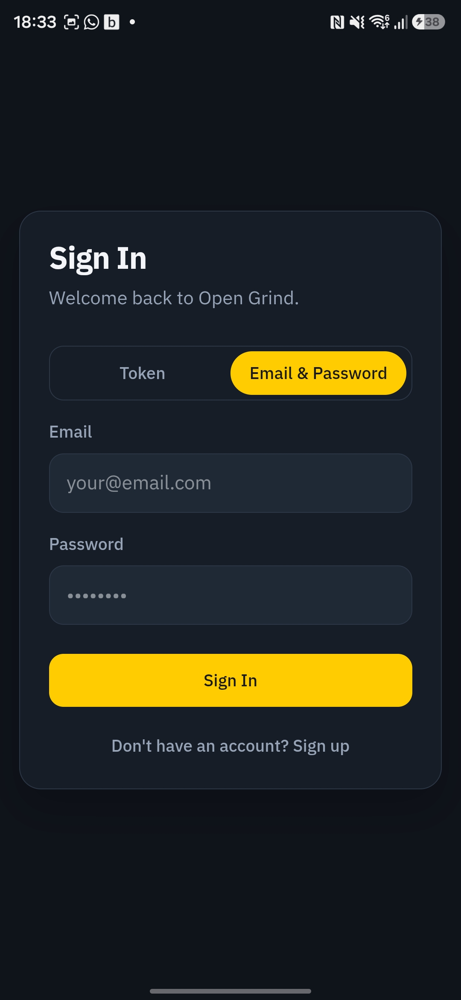
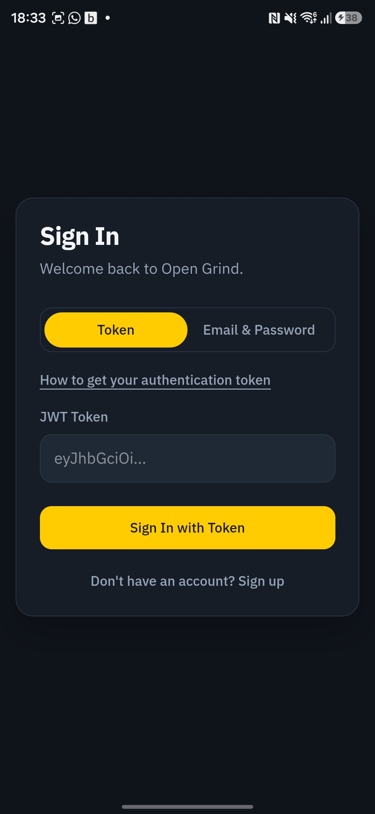
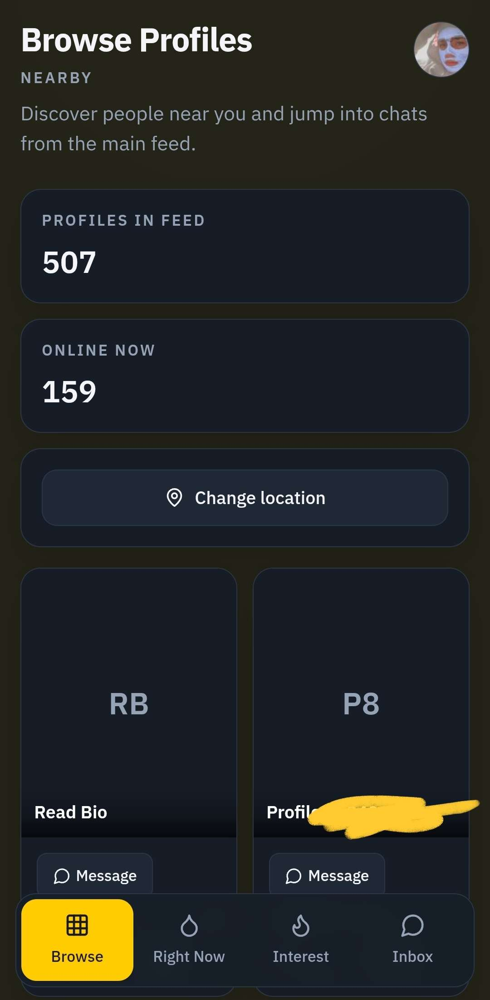
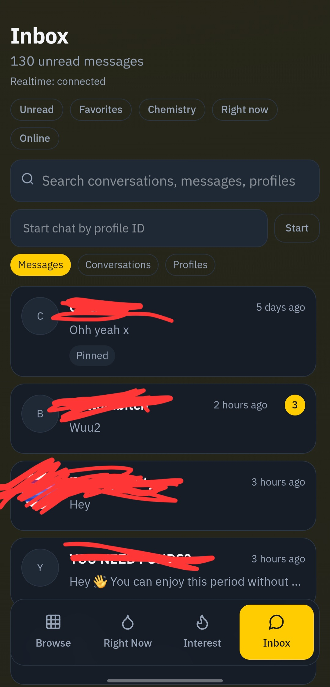
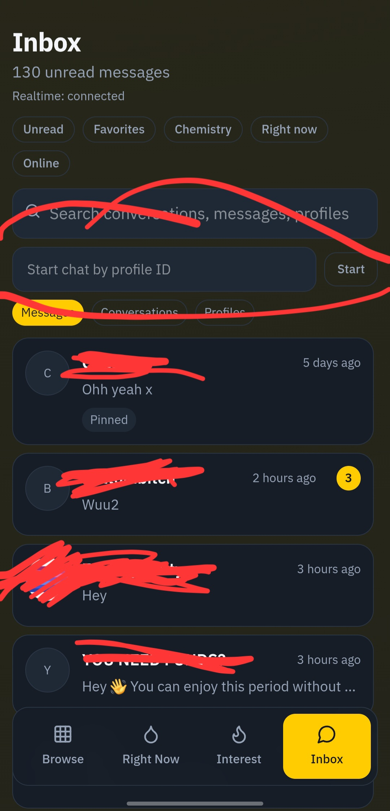
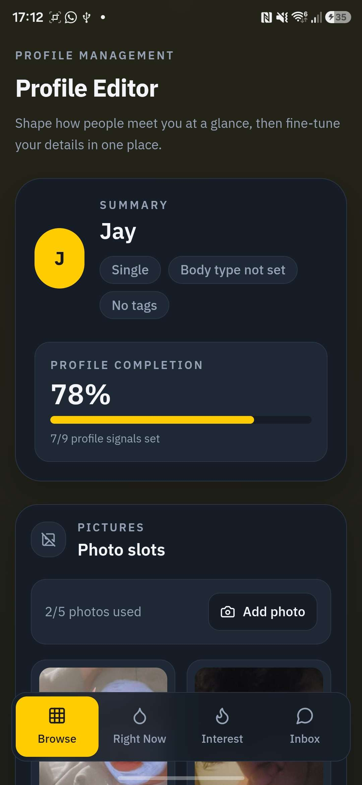
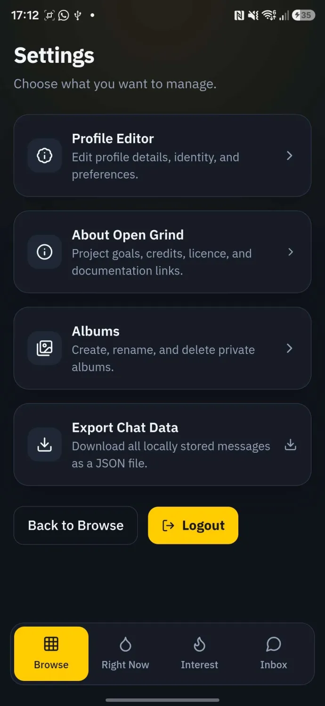

# Getting Started

This guide walks you through your first Open Grind session.

## 1. Sign in

- Open the app.
- Follow the [Login guide](/guide/login) to get your token and sign in.
- Wait for the first sync to finish.

## 2. Browse profiles

- After signing in, the browse grid shows nearby profiles.
- Tap any profile card to view details.

## 3. Open your inbox

- Go to the chat/inbox page.
- Select a conversation from the list.
- If no conversation is selected, choose one to load message history.

## 4. Start a chat by profile ID

- In the inbox panel, enter a numeric profile ID.
- Click Start.
- Send your first message to create/open the conversation.

## 5. Open profile from chat

- Inside a chat thread, use View profile.
- When you leave the profile page, you should return to that chat.

## 6. Edit your profile

- Go to **Settings → Edit Profile** to update your photos, bio, and details.

## 7. App settings

- Open **Settings** to manage preferences, notifications, and account options.

## Next steps

- Learn media workflows in [Chats and Media](/guide/chats-and-media).
- Review account hardening in [Privacy and Safety](/guide/privacy-and-safety).
