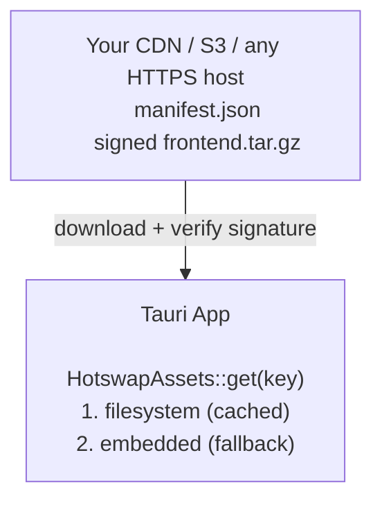

<p align="center">
  <h1 align="center">🔥🔁 tauri-plugin-hotswap</h1>
  <p align="center">
    Open-source OTA frontend updates for Tauri v2 — no binary rebuild, no app store review, no cloud service required.
  </p>
</p>

<p align="center">
  <a href="https://crates.io/crates/tauri-plugin-hotswap"></a>
  <a href="https://www.npmjs.com/package/tauri-plugin-hotswap-api"></a>
  <a href="https://github.com/denniskribl/tauri-plugin-hotswap/actions"></a>
  <a href="https://github.com/denniskribl/tauri-plugin-hotswap/blob/main/LICENSE-MIT"></a>
</p>

<p align="center">
  <a href="#quickstart">Quickstart</a> ·
  <a href="https://denniskribl.github.io/tauri-plugin-hotswap/">Documentation</a> ·
  <a href="docs/api-reference.md">API Reference</a> ·
  <a href="docs/security.md">Security</a> 
</p>

---

## What is this?

An **open-source Tauri v2 plugin** that pushes OTA frontend updates to users instantly — without rebuilding the native binary, without app store review, and without requiring a cloud service. Self-hosted, bring your own CDN.

It works by swapping Tauri's embedded asset provider at startup. The WebView keeps loading from `tauri://localhost` — the swap is invisible. Your keys, your server, your infrastructure. If anything goes wrong, the app rolls back to embedded assets on next launch.

### Platform Support

| Platform | Supported |
|----------|-----------|
| macOS    | ✅        |
| Windows  | ✅        |
| Linux    | ✅        |
| Android  | ✅        |
| iOS      | ✅        |

> **⚠️ App Store / Google Play note:** OTA updates that swap frontend assets (HTML, CSS, JS) within a WebView are generally permitted, but policies can change. Review [Apple's App Store Review Guidelines (3.3.2)](https://developer.apple.com/app-store/review/guidelines/#software-requirements) and [Google Play's Device and Network Abuse policy](https://support.google.com/googleplay/android-developer/answer/9888379) before shipping to ensure your use case complies with the latest rules.

### How it works



---

<a id="quickstart"></a>
## 🚀 Quickstart

### 1. Install

```toml
# src-tauri/Cargo.toml
[dependencies]
tauri-plugin-hotswap = "0.0.4"
```

```bash
npm install tauri-plugin-hotswap-api
```

### 2. Configure

Add to your `tauri.conf.json`:

```json
{
  "plugins": {
    "hotswap": {
      "endpoint": "https://your-server.com/api/updates/{{current_sequence}}",
      "pubkey": "<YOUR_MINISIGN_PUBKEY>"
    }
  }
}
```

> **Config source matters:**
> - `init(context)` reads `plugins.hotswap` from `tauri.conf.json` and requires it.
> - `init_with_config(context, config)` and `HotswapBuilder` are programmatic paths; `plugins.hotswap` in JSON is optional for these.

### 3. Register the plugin

```rust
// src-tauri/src/lib.rs
pub fn run() {
    let context = tauri::generate_context!();
    // init() consumes the context to swap the asset provider,
    // then returns the modified context alongside the plugin.
    let (hotswap, context) = tauri_plugin_hotswap::init(context)
        .expect("failed to initialize hotswap");

    tauri::Builder::default()
        .plugin(hotswap)
        .run(context)
        .expect("error running app");
}
```

Programmatic alternative (no `plugins.hotswap` required in `tauri.conf.json`):

```rust
let context = tauri::generate_context!();
let config = tauri_plugin_hotswap::HotswapConfig::new("<YOUR_MINISIGN_PUBKEY>")
    .endpoint("https://your-server.com/api/updates/{{current_sequence}}");
let (hotswap, context) = tauri_plugin_hotswap::init_with_config(context, config)
    .expect("failed to initialize hotswap");
```

### 4. Add capability

In `src-tauri/capabilities/default.json`:

```json
{
  "identifier": "default",
  "windows": ["main"],
  "permissions": [
    "core:default",
    "hotswap:default"
  ]
}
```

### 5. Use from the frontend

```typescript
import { checkUpdate, applyUpdate, notifyReady } from 'tauri-plugin-hotswap-api';

// ✅ Confirm current version works (call on every startup)
await notifyReady();

// 🔍 Check for updates
const result = await checkUpdate();

if (result.available) {
  // ⬇️ Download, verify, and activate
  await applyUpdate();

  // 🔄 Reload to serve new assets
  window.location.reload();
}
```

That's it. A few lines to add OTA updates to your Tauri app.

You can also change configuration at runtime — for example, to switch channels without restarting:

```typescript
import { configure } from 'tauri-plugin-hotswap-api';

// Switch to a beta channel at runtime
await configure({ channel: 'beta' });
```

---

## ✨ Features

| Feature | Description |
|---------|-------------|
| 🔐 **Signed bundles** | Every download is verified with minisign before extraction |
| ↩️ **Auto-rollback** | If `notifyReady()` isn't called, the next launch rolls back automatically |
| 📡 **Channels** | Route users to `production`, `staging`, `beta` — switchable at runtime via `configure()` |
| 🔑 **Custom headers** | Auth tokens, API keys — sent on every check and download request |
| 🔄 **Retry with backoff** | Failed downloads retry automatically (1s → 2s → 4s → 8s) |
| 🔀 **Download/activate split** | Download now, apply later — you control the timing |
| 📊 **Lifecycle events** | `hotswap://lifecycle` events for telemetry (Sentry, PostHog, etc.) |
| 📏 **Bundle size + mandatory flag** | Warn users on mobile data, force security patches |
| 🌍 **Platform-aware** | Sends `platform`, `arch`, `channel` on every check request |
| 🛡️ **Size limits** | Configurable max bundle size prevents memory exhaustion |
| 🔒 **HTTPS enforced** | Non-HTTPS URLs rejected by default |
| ⚡ **Atomic operations** | Temp dir extraction + rename; temp file pointer writes |
| 🤖 **Custom resolvers** | `HotswapResolver` trait — bring your own update source |
| 📦 **Zip support** | Enable with `features = ["zip"]` |

---

## 📖 Documentation

| Document | Description |
|----------|-------------|
| **[Design Philosophy](docs/philosophy.md)** | Opinionated defaults, extensible when you need it |
| **[Configuration](docs/configuration.md)** | All config options, builder API, tauri.conf.json reference |
| **[API Reference](docs/api-reference.md)** | Full JS and Rust API with examples |
| **[Server Contract](docs/server-contract.md)** | What your update endpoint needs to return |
| **[Security](docs/security.md)** | Threat model, mitigations, signing guide |
| **[Architecture](docs/architecture.md)** | How the plugin works internally |
| **[Creating Bundles](docs/creating-bundles.md)** | Build, sign, upload your frontend bundles |
| **[CONTRIBUTING](CONTRIBUTING.md)** | How to contribute to this project |
| **[CHANGELOG](CHANGELOG.md)** | Version history |

---

## 🛡️ Security

Every update is **cryptographically signed** with minisign and verified before extraction. The plugin is designed to fail safely — if anything goes wrong, the app falls back to embedded assets.

See the full [Security documentation](docs/security.md) for the threat model and all mitigations.

---

## License

MIT OR Apache-2.0 (same as Tauri)
